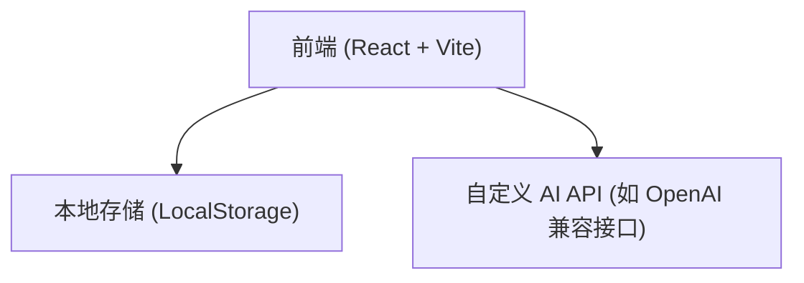
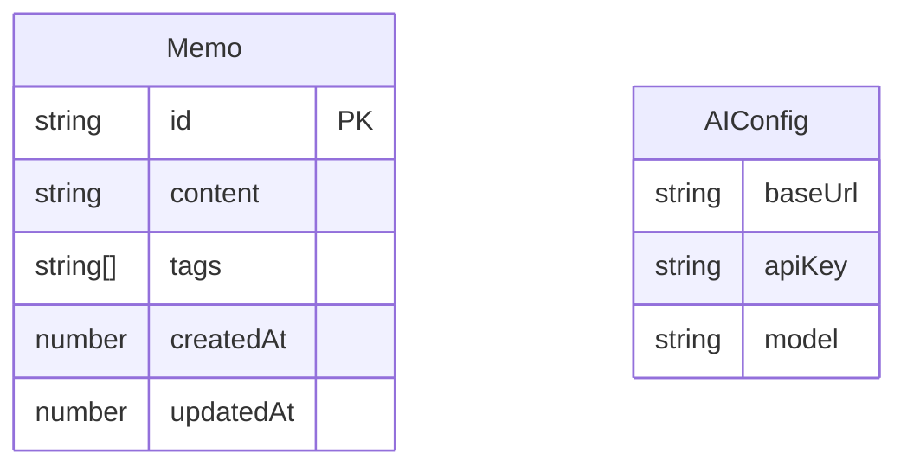

## 1. 架构设计

## 2. 技术说明
- 前端框架：React@18 + Vite
- 样式方案：Tailwind CSS v3 + Lucide React (图标)
- 状态管理：Zustand (管理笔记列表、标签和 AI 配置)
- 路由管理：React Router v6
- 本地存储：localStorage (用于纯前端持久化)
- AI 请求：Fetch API，支持流式 (Streaming) 或非流式响应。

## 3. 路由定义
| 路由 | 目的 |
|------|------|
| / | 主页工作台（包含输入框、笔记流、侧边标签栏） |
| /review | 每日回顾页面 |
| /settings | AI 设置页面 |

## 4. 数据模型
### 4.1 数据模型定义

